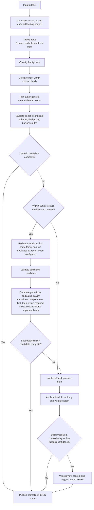

# Invoice Extraction Pipeline Solution

## 1. Solution overview

This solution implements a deterministic-first extraction pipeline for four document families: carrier invoices, ocean freight invoices, customs entries, and supplier invoice workbooks.
The runtime flow is: probe input, classify family once, optionally detect vendor within that family, run the generic extractor, optionally reroute once to a dedicated extractor within the same family, validate the candidate, compare results when both generic and dedicated outputs exist, and then either complete, invoke fallback, or escalate to human review.

The design is intentionally deterministic-first because deterministic routing, extraction, and validation are easier to audit, tune, and operate than an always-generative pipeline. **The fallback path remains stubbed** because the production integration point is deliberately isolated behind an interface, but the current pipeline in this repo does not depend on any external recovery service. Family reclassification is intentionally out of scope because the design optimizes for predictable control flow and bounded routing complexity rather than recursive retry behavior.

## 1.1 Decision flow

At a high level, the deterministic path moves through four stages:

1. Extraction phase
2. Validation phase
3. Scoring and ranking phase
4. Preferred-result selection

When only one deterministic extraction result exists, the pipeline validates that result and either completes or continues to fallback. When both a generic result and a dedicated result exist for the same artifact, the scoring and ranking stage compares those two results before selecting the preferred deterministic result.

## 2. Design goals

- Keep routing simple, explainable, and single-pass at the family level.
- Prefer deterministic extraction over opaque model behavior.
- Separate family routing, vendor routing, extraction, validation, fallback, review, and storage concerns.
- Make every run traceable through `artifact_id`-keyed artifacts and structured logs.
- Preserve a clean production path for replacing local storage and stubbed fallback components later.

## 3. Routing model

Routing is documented in detail in [Pipeline Routing](docs/architecture/pipeline-routing.md#routing-model).

The implementation keeps family routing single-pass, keeps vendor detection inside the selected family, and starts extraction with the family-level generic extractor before any dedicated within-family reroute. The detailed behavior for [family classification](docs/architecture/pipeline-routing.md#family-classification), [vendor detection](docs/architecture/pipeline-routing.md#vendor-detection), and [generic-first extraction](docs/architecture/pipeline-routing.md#why-extraction-is-generic-first) lives in the routing document so those mechanics are described in one place.

## 4. Required-field gating via YAML policy

Required, important, optional, and conditional fields are defined in [`field_policies.yaml`](config/field_policies.yaml). `FieldPolicyValidator` evaluates path-level presence and value quality, including array paths such as `shipments[].tracking_number` and conditional requirements such as requiring charge details when charges exist. This makes gating configuration-driven instead of hard-coded per extractor.

## 5. Validation model

**Validation is layered**:
- Schema validation checks that the extracted output matches the expected JSON structure and field types.
- Field-policy validation checks must-have and important-field coverage.
- Business validation checks family-specific contradictions such as arithmetic mismatches, duplicate identifiers, or invalid date ordering.

Any unresolved must-have field or contradiction is treated as an incomplete deterministic result.

The solution distinguishes between:

- the internal candidate payload used during extraction, reroute comparison, and fallback merging
- the published normalized JSON contract written to `out/{artifact_id}.json`, where `{artifact_id}` uses the template `art_YYYYMMDDHHMMSS_<8 hex chars>`.

## 6. Result quality comparison

When both generic and dedicated candidates exist, the pipeline compares them on must-have completeness first, then invalid required fields, contradictions, and valid important fields. The detailed explanation, priority order, and worked example now live in [Selection rule](docs/architecture/pipeline-routing.md#selection-rule).

For the canonical FedEx input PDF in this solution, the dedicated candidate won because it had stronger must-have completeness; preferred-result selection is quality-based rather than hard-coded to prefer dedicated output.

## 7. Fallback stub design

Fallback is implemented behind a provider interface and is currently configured as a stub. If deterministic extraction still has unresolved must-have fields or contradictions, the pipeline invokes the recovery provider, merges its patch into the best deterministic payload, and revalidates the merged result. The merged payload is now revalidated directly as a dict so fallback does not silently drop fields through a lossy model rebuild. In the current implementation, the stub returns no data patch, zero confidence, and explicit notes that no external model call was performed.

## 8. PDF and OCR runtime behavior

PDF handling is explicit. The pipeline first attempts embedded-text extraction through `pypdf`. If no usable embedded text is present, it falls back to page rendering with `pypdfium2` plus OCR through `rapidocr_onnxruntime`. The previous raw-binary PDF text fallback was removed.

If a PDF has no usable embedded text and the OCR stack is unavailable in the active venv, the CLI now fails clearly instead of silently degrading.

## 9. Human review trigger rules

Human review is triggered when unresolved required fields remain, when business contradictions remain, or when fallback runs with confidence below the configured threshold. When review is required, the solution writes a review context artifact containing the normalized payload, validation issues, fallback confidence, and reviewer guidance.

## 10. Artifact storage abstraction

Artifacts are written through an `ArtifactStore` interface. The current implementation is local and stores the original input, normalized output, execution metadata, review context, and event log under `out/artifacts/{artifact_id}/`. These generated artifacts are runtime output, not canonical source files.

The abstraction is already shaped for a bucket-oriented production design. A future implementation can preserve the same logical layout while moving persistence to object storage without changing pipeline orchestration or logging semantics.

## 11. `artifact_id` and structured logging

Each run receives a generated `artifact_id` and all persisted outputs and JSONL events are keyed by it. The structured logger records pipeline milestones such as probe completion, family selection, vendor detection, extractor selection, validation summaries, quality comparison, fallback events, review escalation, and final output write. This gives the solution an audit trail suitable for operational debugging and downstream observability.

## 12. Adding a format

Adding a format starts with one architectural decision: determine whether the new input should be modeled as a new document family or as a vendor-specific pattern inside an existing family. That decision affects the routing layer, the extractor type, and the validation surface you need to extend.

In general, adding a format means updating the routing rules, implementing or extending the relevant extractor, aligning the normalized output contract, and updating validation and verification coverage so the new path is checked end to end. The main consideration is to keep the change at the correct layer: add a new family only when the document shape is genuinely different, and prefer a vendor-specific extension when the format is a specialized case within an existing family.

The full implementation checklist can be found in [Extending the pipeline](docs/architecture/pipeline-routing.md#extending-the-pipeline). Use [Change guide](docs/architecture/pipeline-routing.md#change-guide) when the main question is where the new format belongs in the routing model.

## 13. Out-of-scope items

- Reclassifying document family after the initial family decision.
- A production LLM or external recovery service behind the fallback interface.
- Multi-vendor dedicated extractors beyond FedEx.
- Queueing, orchestration, and reviewer workflow UX beyond emitting review artifacts.
- Remote object storage implementation and retention policy.

## 14. Verification summary

The end-to-end match results against `expected_output/` are described in [`src.verification.report`](README.md#srcverificationreport) in [README.md](README.md#srcverificationreport).
This section only lists the additional verification facts from `src/verification/report.py`:

- all 4 input files in `invoices/` were classified into the correct family on the first pass
- rerouting within the same family happened at most once per file
- the FedEx PDF file in `invoices/` does not contain usable embedded text, so the pipeline uses OCR to read it, routes it to the dedicated FedEx extractor, and completes successfully
- fallback and human review are implemented, but they were not triggered in the final FedEx run

## AI Collaboration

AI was used as a copilot for design framing, implementation iteration, and document review, not as the runtime extraction engine. The primary setup was the Codex app and VS Code using GPT-5.4 for code and writeup iteration, with ChatGPT used for design oversight and initial prompt generation, plus targeted review and rewrite passes.

The working pattern was narrow prompts, inspect the generated change, then tighten constraints and iterate until the behavior or explanation matched the intended architecture. AI helped most with accelerating boilerplate-heavy refactors, tightening technical prose, and surfacing edge cases to verify. It was less reliable on architecture-specific details, especially when asked to infer pipeline invariants or claim behavior without checking the current code, so deterministic logic, validation rules, and final wording still required manual review.
