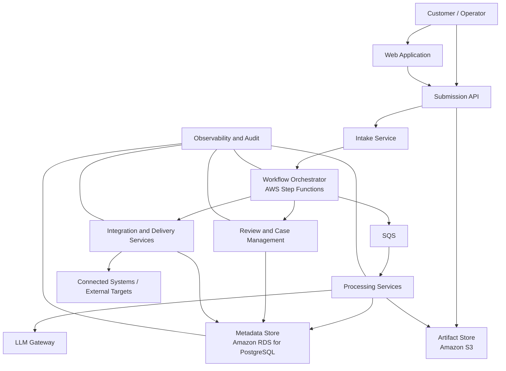

# Architecture Overview

```mermaid
flowchart TD
    U[Customer / Operator]
    W[Web Application]
    API[Submission API]
    INTAKE[Intake Service]
    ORCH[Workflow Orchestrator<br/>AWS Step Functions]
    QUEUE[SQS]
    PROC[Processing Services]
    LLM[LLM Gateway]
    REVIEW[Review and Case Management]
    DELIVERY[Integration and Delivery Services]
    S3[Artifact Store<br/>Amazon S3]
    RDS[Metadata Store<br/>Amazon RDS for PostgreSQL]
    OBS[Observability and Audit]
    EXT[Connected Systems / External Targets]

    U --> W
    U --> API
    W --> API

    API --> INTAKE
    API --> S3
    INTAKE --> ORCH

    ORCH --> QUEUE
    QUEUE --> PROC
    PROC --> LLM
    PROC --> RDS
    PROC --> S3

    ORCH --> REVIEW
    REVIEW --> RDS

    ORCH --> DELIVERY
    DELIVERY --> EXT
    DELIVERY --> RDS

    OBS --- ORCH
    OBS --- PROC
    OBS --- REVIEW
    OBS --- DELIVERY
    OBS --- RDS
```
