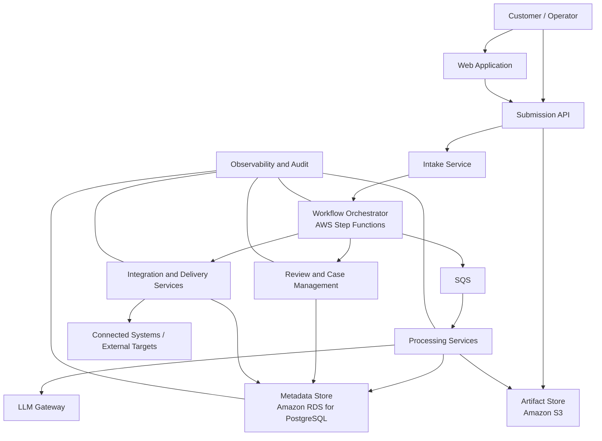

# Architecture Overview

This document is the short introduction to the system architecture.

If you are new to the repo, read this file first. If you need the full design, read [system-architecture.md](./system-architecture.md).

## What this system is

This system is a multi-tenant document operations platform.

Customers submit files such as invoices or other business documents. The platform accepts those files, decides how they should be processed, runs the right processing steps, stores the important artifacts and metadata, and then produces a normalized internal result plus a customer-facing delivery output.

The invoice extraction pipeline in this repo is one example workload running on that broader platform. The architecture is intentionally wider than a single invoice-only pipeline.

## What the system is trying to achieve

At a high level, the architecture is designed to:

- accept document-driven work from multiple customers
- process different workflow types in a controlled way
- keep orchestration logic separate from heavy processing work
- support both deterministic processing and model-assisted stages
- escalate unresolved cases to human review when automation is not enough
- preserve auditability, traceability, and operational control
- stay practical for a production environment rather than being a purely conceptual design

## The core idea

The architecture splits responsibilities clearly:

- Step Functions owns workflow coordination: what step runs next, when retries happen, when branching happens, and when review or delivery paths are triggered
- EKS-hosted services and workers do the actual application work: intake, processing, enrichment, review actions, and delivery
- S3 stores large file artifacts and generated artifacts
- PostgreSQL stores metadata, business state, workflow-related records, and other operational data

This split matters because workflow state and processing logic have different scaling and operational needs. The architecture tries to keep those concerns separate instead of mixing everything into one service.

## End-to-end flow

1. A customer or connected system submits a file.
2. The platform accepts the submission and stores the raw artifact.
3. Workflow orchestration starts and decides which processing path to run.
4. Workers perform processing steps such as classification, extraction, validation, enrichment, or model-assisted handling.
5. If the result is incomplete, contradictory, or needs approval, the system creates or updates a Case for human review.
6. When processing is complete, the system produces a **Canonical Result**, which is the stable internal output of the platform.
7. If the result must be sent externally, the platform generates a **Delivery Payload**, which is the customer-facing or integration-facing output.

## Main platform pieces

### Web Application

This is the user-facing interface for operators and reviewers. It is separate from the backend runtime and talks to the platform through APIs.

### Submission API

This is the main entry point for incoming work. It validates requests, applies tenant rules, registers submissions, and starts the workflow.

### Intake Service

This is the internal acceptance layer after submission. It is responsible for turning incoming content into a tracked platform item that the rest of the system can process.

### Workflow Orchestrator

This is the control layer, implemented with AWS Step Functions. It does not perform the heavy document processing itself. Its job is to coordinate the sequence of work, retries, branching, batch control, and review escalation.

### Processing Services

These are the worker services that do the actual document-related work. Depending on the workflow, they may classify documents, extract fields, validate outputs, enrich data, or run fallback logic.

### LLM Gateway

This is the required boundary for model-provider access. If the platform uses AI or LLM-backed behavior, services are expected to go through this gateway instead of calling providers directly. That keeps provider routing, credentials, and policy enforcement in one place.

### Review and Case Management

When automation cannot safely finish the job, the platform creates a Case so a person can inspect, correct, approve, or continue the workflow.

### Integration and Delivery Services

These services handle outbound communication. They are responsible for APIs, webhooks, exports, downstream system actions, and delivery-related integration behavior.

### Artifact Store

This is where large files and generated artifacts live. The architecture assumes object storage for this role.

### Metadata Store

This is where the platform keeps structured operational and business data. The architecture assumes PostgreSQL for this role.

### Observability and Audit

This covers logs, traces, metrics, audit history, and operational visibility.

## The main data objects

The architecture uses a few key terms that matter:

- **Source Artifact**: the raw uploaded file
- **Document**: the in-progress processing object while the file is being worked on
- **Case**: the object used when review, exception handling, or tracked follow-up is needed
- **Canonical Result**: the stable internal output after processing completes
- **Delivery Payload**: the external output sent to a customer or another system

These distinctions are important because the system is not designed as a single “file in, JSON out” script. It tracks different states and outputs for different operational purposes.

## Important design principles

### Multi-tenant

The platform is designed for multiple customers sharing the same system (cluster). That means the architecture has to care about tenant isolation, tenant-specific rules, and fairness in shared processing capacity.

### Workflow-driven

The platform is not just a collection of parsers. It is built around explicit workflows, retries, review paths, reprocessing paths, and delivery paths.

### Deterministic-first, but not deterministic-only

The broader platform supports model-assisted stages, but those stages are treated as bounded and governed parts of the system, not as the default answer to every problem.

### Separates internal truth from external delivery

The Canonical Result is the platform’s internal normalized output. The Delivery Payload is what gets exposed externally. This keeps internal system design separate from customer-facing integration contracts.

### Dsigned for operations, not just processing

The architecture pays attention to tracing, auditability, recovery, replay, and operator visibility.

## What this architecture is not

This architecture does not try to fully lock down every low-level implementation choice.

Some details are intentionally left open, such as exact queue topology, exact fairness mechanisms, exact read-scaling strategy, and exact operator tooling shape.
That is deliberate. The goal of the architecture is to set strong boundaries and realistic expectations without pretending every implementation detail is already decided.

## Diagram

